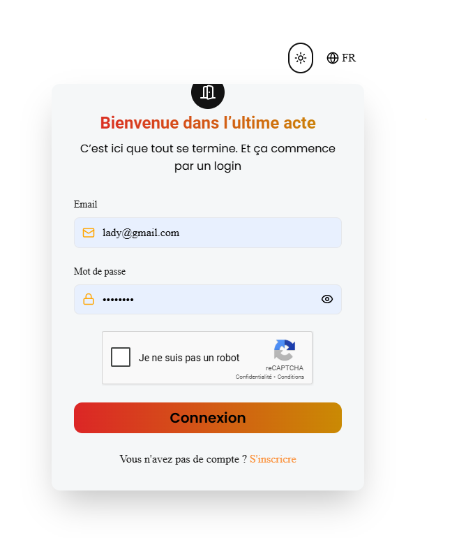
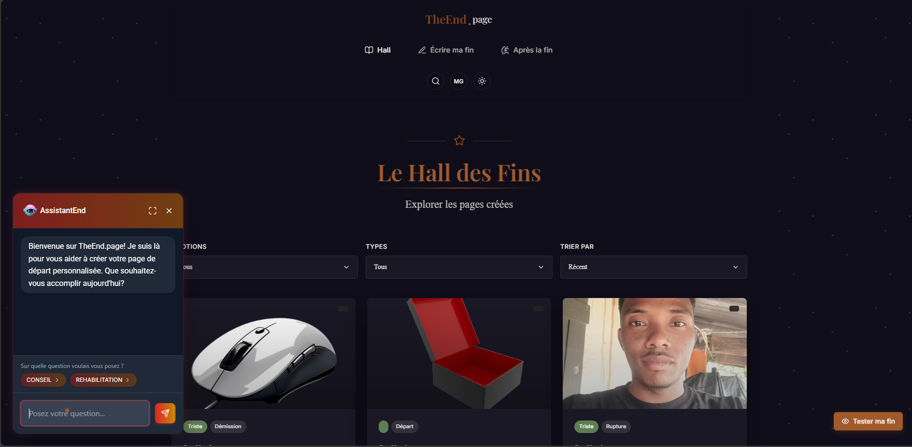
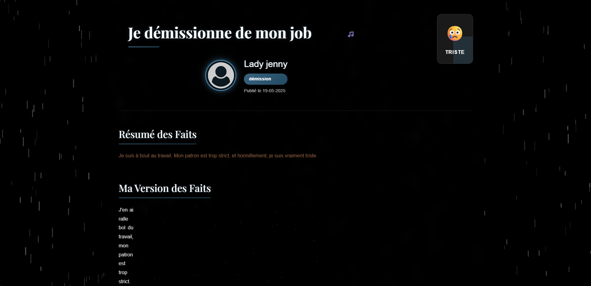
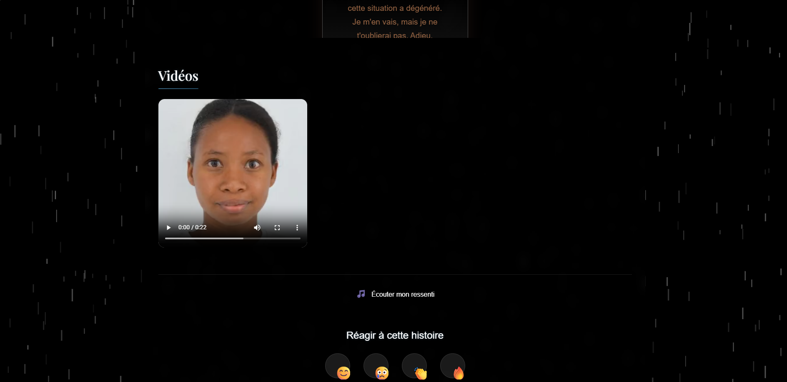
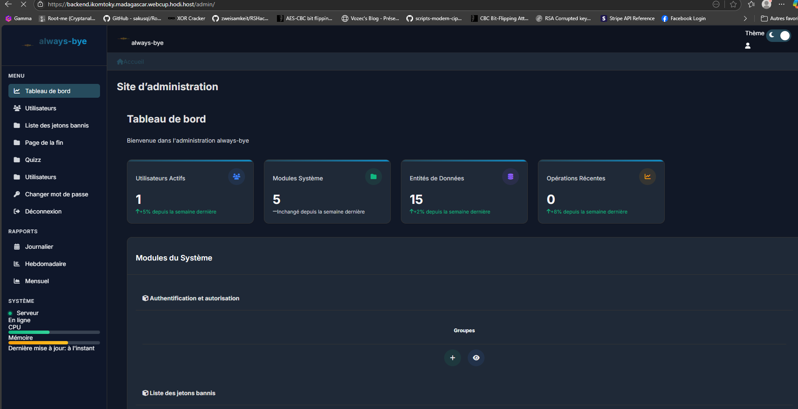

---

# 🧠 Webcup 2025 - Projet The End of Page

## Présentation Technique

The End of Page est une application web interactive axée sur la création de "pages de fin" personnalisées. Grâce à un moteur 3D, des outils d’IA générative (voix et vidéo), un système de chat intelligent et une interface utilisateur riche, les utilisateurs peuvent concevoir des histoires uniques à partager.

---

## 🧰 Stack Technique

### 🎨 Frontend (Vite + React + Tailwind + Three.js)

* **Framework** : React 18 avec Vite
* **Styling** : Tailwind CSS, CSS modules
* **3D et Avatars** :

  * `@react-three/fiber`, `three.js` pour le rendu
  * Morph targets pour les expressions faciales
  * Composants personnalisés : `Avatar`, `CameraControls`, `CharacterConfigurator`, etc.
* **Authentification & Sécurité** :

  * React Router avec route guards
  * Intégration de CAPTCHA
* **Fonctionnalités utilisateur** :

  * Personnalisation des pages : ton, émotion, histoire vécue, typographie, couleur, etc.
  * Galerie filtrable de fins existantes (catégories, popularité)
  * Avatars 3D animés et configurables
  * Génération de pages de fin publiques, partageables
  * Système de réactions (4 types)
* **Organisation du code** :

  * Séparation logique des domaines : `authentification`, `endpage`, `ecrireMaFin`, `hallDesFins`, `hooks`, etc.

### 🧪 Tests

* Script de peuplement automatique : `seed_endpage.py`
* Tests unitaires organisés dans chaque module backend

---

### 🖥 Backend (Django 5 + DRF + WebSockets)

* **Framework** : Django + Django Rest Framework (DRF)
* **Modules principaux** :

  * `user` : Authentification JWT, gestion des utilisateurs
  * `chat` : WebSocket avec `channels` pour les discussions avec l’IA
  * `quizz` : Quiz contextuel pour aider à construire une fin
  * `endpage` : CRUD des pages de fin, filtres, réactions
* **IA et Multimédia** :

  * Génération audio via ElevenLabs (TTS)
  * Animation vidéo via SadTalker (image + voix)
* **Sécurité** :

  * CAPTCHA sur login/register
  * JWT pour sécuriser les endpoints
  * Filtres par utilisateur, popularité, catégorie
* **WebSocket** :

  * Support de discussion personnalisé via IA
* **Services internes** :

  * `helpers/services/` : encapsule les appels IA externes (TTS, animation)

---

## 🔐 Sécurité

* Authentification JWT avec contrôle middleware
* CAPTCHA sur endpoints critiques
* Protection des routes frontend
* Configuration CORS
* Variables d’environnement dans `.env`

---

## 📁 Structure du Projet

### Frontend (dossier `frontend/src`)

```
├── 3d/               // Avatar 3D : animation, morph, contrôle
├── authentification/ // Pages de connexion et inscription
├── endpage/          // Logique des pages finales (vidéo, audio)
├── ecrireMaFin/      // Interface pour écrire sa propre fin
├── hooks/            // Hooks personnalisés : API, contexte
├── landinpage/       // Composants de la page d’accueil
├── hallDesFins/      // Galerie filtrable des fins
└── mesFins/          // Pages de fin créées par l’utilisateur
```

### Backend (dossier `backend-ikom-webcup2025`)

```
├── apps/
│   ├── user/     // Authentification, modèle utilisateur
│   ├── chat/     // Chat IA temps réel via WebSocket
│   ├── quizz/    // Recommandations contextuelles
│   └── endpage/  // CRUD des pages de fin + réactions
├── config/       // Paramétrage global Django
├── helpers/
│   └── services/
│       ├── chat/        // Chat IA
│       ├── evenlabs/    // Audio émotionnel (TTS)
│       └── sadtalker/   // Animation vidéo
├── manage.py
├── requirements.txt
└── .env
```

---

## 🧪 Fonctionnalités Clés

* 🔐 **Sécurité** : Authentification JWT, CAPTCHA, route guards
* 🧍 **Personnalisation 3D et visuelle** :

  * Avatars configurables selon genre, posture, expression
  * Paramètres de ton, police, émotion, couleur, image
* 🎧 **Multimédia & IA** :

  * Génération audio avec tonalité adaptée
  * Vidéo animée avec photo de l’utilisateur
* 💬 **Chat IA** :

  * Conseils personnalisés sur sa situation
  * Dialogue contextuel et recommandations
* 📚 **Hall des Fins** :

  * Liste publique des pages de fin
  * Filtres par catégorie/popularité
  * Réactions et partage de lien unique

---

## 🚀 Lancer le Projet

### Frontend

```bash
cd frontend
npm install
npm run dev
```

### Backend

```bash
cd backend-ikom-webcup2025
python -m venv venv
source venv/bin/activate  # ou .\venv\Scripts\activate sur Windows
pip install -r requirements.txt
python manage.py migrate
python manage.py runserver
```

---

## 🎬 Captures d’écran

### Page de login avec CAPTCHA



### Hall des fins : galerie filtrable



### Personnalisation de l’avatar 3D


### Exemples de pages de fin




### Page d’administration Django

[Accès Admin](https://backend.ikomtoky.madagascar.webcup.hodi.host/admin)


